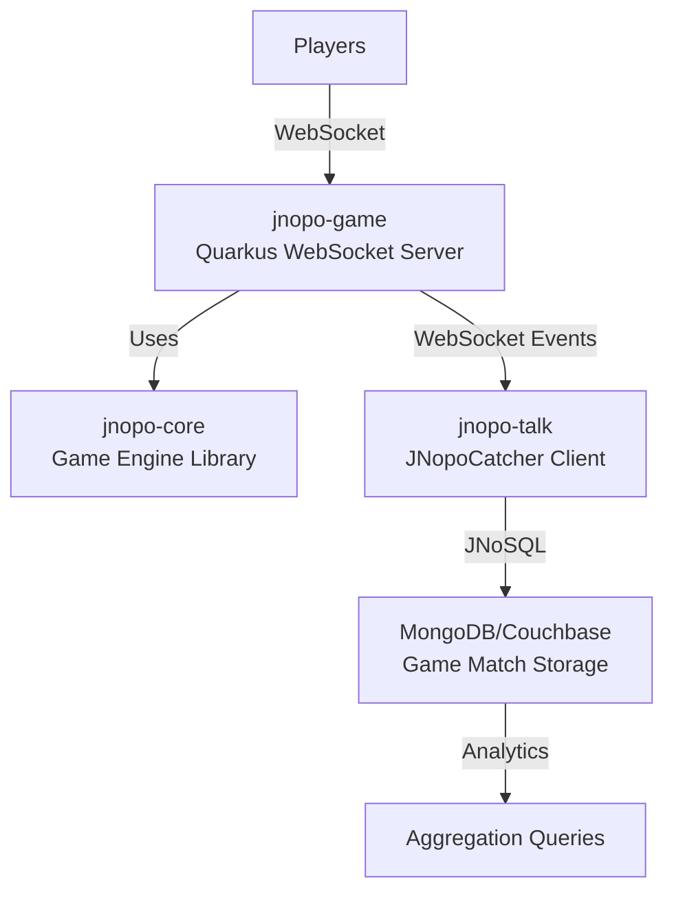

# JNopo - Rock-Paper-Scissors Game Ecosystem

[](https://www.oracle.com/java/)
[](https://maven.apache.org/)
[](https://quarkus.io/)
[](https://jakarta.ee/)
[](LICENSE)

A comprehensive multi-module Java 21 application demonstrating **Rock-Paper-Scissors (Jokenpo)** game implementation across different architectural patterns: pure Java library, cloud-native real-time multiplayer with Quarkus, and Jakarta EE enterprise application with NoSQL integration.

## 📋 Table of Contents

- [Project Overview](#project-overview)
- [Architecture](#architecture)
- [Modules](#modules)
  - [jnopo-core](#jnopo-core---game-engine-library)
  - [jnopo-game](#jnopo-game---real-time-multiplayer-backend)
  - [jnopo-talk](#jnopo-talk---presentation-application)
- [Integration Flow](#integration-flow)
- [Quick Start](#quick-start)
- [Development](#development)
- [Deployment](#deployment)
- [Contributing](#contributing)

## 🎯 Project Overview

**JNopo** is an educational project created for presentation purposes, demonstrating modern Java development practices, cloud-native patterns, and NoSQL database integration. The project showcases:

- ✅ **Modern Java**: Java 21 features (Records, Pattern Matching, Switch Expressions)
- ✅ **Cloud-Native**: Quarkus with GraalVM native compilation support
- ✅ **Real-Time Communication**: WebSocket-based multiplayer gaming
- ✅ **NoSQL Integration**: JNoSQL with MongoDB and Couchbase
- ✅ **Enterprise Java**: Jakarta EE 11 and MicroProfile 7.0
- ✅ **Multi-Runtime**: Open Liberty and WildFly support
- ✅ **Container-Ready**: Docker and Kubernetes/OpenShift deployment

## 🏗️ Architecture

### Multi-Module Structure

```
jnopo (parent)
├── jnopo-core      → Pure Java game engine library
├── jnopo-game      → Quarkus real-time multiplayer backend
└── jnopo-talk      → Jakarta EE presentation/demo application
```

**Parent POM**: `br.org.soujava.coffewithjava:jnopo:2.0.0`

**Technology Stack**:
- **Java**: 21
- **Build Tool**: Maven 3.8+
- **Frameworks**: Quarkus 3.29.0, Jakarta EE 11, MicroProfile 7.0
- **Databases**: MongoDB, Couchbase (via JNoSQL 1.1.10)
- **Runtimes**: Quarkus, Open Liberty, WildFly
- **Testing**: JUnit 5.11.3, AssertJ 3.26.3, RestAssured

## 📦 Modules

### jnopo-core - Game Engine Library

**Purpose**: Pure Java library providing the core game logic for Jokenpo (Rock-Paper-Scissors).

**Key Features**:
- 🎯 **Immutable Domain Model**: Built with Java 21 Records
- 🔄 **Type-Safe Game States**: State machine pattern
  - `WaitingPlayers` → `GameReady` → `GameRunning` → `GameOver` / `GameAbandoned`
- 🛡️ **Pattern Matching**: Leverages Java 21 switch expressions
- 📦 **Zero Dependencies**: No external runtime dependencies

**Design Highlights**:
- Thread-safe immutable objects
- Clear separation between domain logic and presentation
- Comprehensive unit tests with JUnit 5 and AssertJ

**Documentation**: See [jnopo-core/README.md](jnopo-core/README.md) for detailed API documentation.

---

### jnopo-game - Real-Time Multiplayer Backend

**Purpose**: Cloud-native WebSocket server built with Quarkus for real-time multiplayer gameplay.

**Technology Stack**:
- **Framework**: Quarkus 3.29.0
- **Protocols**: WebSocket (primary), REST API (health/monitoring)
- **Serialization**: JSON-B (JSON Binding)
- **Cloud-Native**: OpenShift-ready, Kubernetes manifests included
- **Native Compilation**: GraalVM support

**Key Components**:

| Component | Endpoint | Description |
|-----------|----------|-------------|
| `GameServer` | `/jnopo/{playerName}` | Main WebSocket endpoint handling game logic |
| `GameStageCaptureServer` | `/jnopo-catch/{name}` | Game stage event capture/broadcast |
| `ChatServer` | `/chat/{name}` | In-game chat functionality |

**Features**:
- 🎮 Real-time multiplayer gameplay
- 💬 Built-in chat system
- 📊 Game state management
- 🔌 Automatic disconnection handling
- 🏥 Health checks and monitoring
- 🐳 Container-ready (JVM and Native)
- ☸️ Kubernetes/OpenShift deployment manifests

**Deployment Options**:
- **Dev Mode**: Live reload with `./mvnw quarkus:dev`
- **JVM Mode**: Standard Java runtime
- **Native Mode**: GraalVM native binary (fast startup, low memory)
- **Container**: Docker images (JVM/Native)
- **Cloud**: OpenShift Developer Sandbox (free tier), Kubernetes

**Documentation**: See [jnopo-game/README.md](jnopo-game/README.md) for deployment guides.

---

### jnopo-talk - Presentation Application

**Purpose**: Jakarta EE 11 web application demonstrating JNoSQL integration with NoSQL databases (MongoDB, Couchbase). Created for presentation purposes to showcase Jakarta NoSQL, Jakarta Data, and Eclipse JNoSQL utilization.

**Technology Stack**:
- **Jakarta EE**: 11.0.0-M4
- **MicroProfile**: 7.0
- **JNoSQL**: 1.1.10 (MongoDB + Couchbase drivers)
- **OpenTelemetry**: Instrumentation for observability
- **Databases**: MongoDB, Couchbase

**Deployment Profiles**:

#### 1. Open Liberty (Default)

```bash
./mvnw -Popen-liberty liberty:run      # Production
./mvnw -Popen-liberty liberty:dev      # Dev mode with hot reload
```

- **Port**: 9080 (HTTP), 9443 (HTTPS)
- **Context**: `/jnopo-talk`
- **OpenAPI UI**: `/openapi/ui/`
- **Plugin**: `liberty-maven-plugin:3.11.5`

#### 2. WildFly

```bash
./mvnw -Pwildfly wildfly:run           # Production
./mvnw -Pwildfly wildfly:dev           # Dev mode with hot reload
```

- **Port**: 8080
- **Context**: `/jnopo-talk`
- **Plugin**: `wildfly-maven-plugin:5.0.1.Final`
- **Feature Packs**:
  - `wildfly-ee-galleon-pack:33.0.2.Final`
  - `wildfly-datasources-galleon-pack:8.0.1.Final`
- **Layers**: `cloud-server`, `microprofile-platform`

**Key Components**:
- **`JNopoCatcher`**: WebSocket client connecting to `jnopo-game` to capture game events
- **Database Persistence**: Stores game match results in `GameMatch` collection
- **MicroProfile Config**: Runtime database switching via properties

**Database Configuration**:

Switch between MongoDB and Couchbase by setting `jnosql.document.provider` in `microprofile-config.properties`:

```properties
# For MongoDB
jnosql.document.provider=org.eclipse.jnosql.databases.mongodb.communication.MongoDBDocumentConfiguration

# For Couchbase
jnosql.document.provider=org.eclipse.jnosql.databases.couchbase.communication.CouchbaseDocumentConfiguration
```

**Database Setup**:

Start required NoSQL databases using Docker Compose:

```bash
cd jnopo-talk
docker-compose up -d
```

This starts:
- **MongoDB** (port 27017)
- **Mongo Express** (port 8081) - Web UI for MongoDB
- **Couchbase** (port 8091) - Requires manual cluster configuration

**Analytics Example**:

MongoDB aggregation pipeline to rank winners:

```javascript
use jnopo
db.GameMatch.aggregate([
  { $match: { tied: { $eq: false }}},
  { $group: { _id: "$winner.name", total: { $sum: 1 }}},
  { $sort: { total: -1 }}
])
```

**Docker Images**:
- `openliberty.Dockerfile`: Open Liberty container
- `wildfly.Dockerfile`: WildFly container

**Documentation**: See [jnopo-talk/README.md](jnopo-talk/README.md) for detailed setup instructions.

## 🔄 Integration Flow



**Data Flow**:
1. Players connect to `jnopo-game` WebSocket endpoints
2. Game logic executes via `jnopo-core` library
3. `jnopo-talk` listens to game events via WebSocket client (`JNopoCatcher`)
4. Game results persisted to NoSQL database via JNoSQL
5. Analytics queries available via MongoDB aggregation

## 🚀 Quick Start

### Prerequisites

- **Java**: 21+ ([Adoptium](https://adoptium.net/))
- **Maven**: 3.8+ (or use included Maven Wrapper)
- **Docker**: For running databases and containers
- **GraalVM**: Optional, for native compilation

> **Note**: Maven Wrapper is included. You may need to run `chmod +x mvnw` first.

### Build Everything

```bash
./mvnw clean install
```

### Run jnopo-game (Quarkus)

```bash
cd jnopo-game
./mvnw quarkus:dev
```

Access the game at: **http://localhost:8080/jnopo.html**

### Run jnopo-talk (Open Liberty)

```bash
cd jnopo-talk
docker-compose up -d              # Start databases
./mvnw -Popen-liberty liberty:dev
```

Access the application at: **http://localhost:9080/jnopo-talk**

OpenAPI UI: **http://localhost:9080/openapi/ui/**

### Run jnopo-talk (WildFly)

```bash
cd jnopo-talk
docker-compose up -d              # Start databases
./mvnw -Pwildfly wildfly:dev
```

Access the application at: **http://localhost:8080/jnopo-talk**

## 🛠️ Development

### Development Standards

The project follows strict development standards defined in `.github/instructions/`:

- **Java Guidelines** (`java.instructions.md`): Base Java development standards
- **Quarkus Standards** (`quarkus.instructions.md`):
  - Use `@ApplicationScoped` over `@Singleton`
  - Prefer Panache for data access
  - Use `@Transactional` for modifications
  - Write `@QuarkusTest` for integration tests
  - Follow Jakarta EE and MicroProfile conventions

### Code Quality Tools

Helpful prompts available in `.github/prompts/`:
- `java-docs.prompt.md`: Javadoc best practices
- `java-junit.prompt.md`: JUnit 5 testing patterns
- `conventional-commit.prompt.md`: Git commit conventions

### Testing

**Run all tests**:
```bash
./mvnw test
```

**Run module-specific tests**:
```bash
cd jnopo-core && ./mvnw test       # Unit tests
cd jnopo-game && ./mvnw test       # WebSocket integration tests
cd jnopo-talk && ./mvnw test       # Jakarta EE tests
```

**Test Coverage**:
- ✅ `jnopo-core`: Comprehensive unit tests
- ✅ `jnopo-game`: WebSocket integration tests (`GameServerTest`, `ChatServerTest`)
- ⚠️ `jnopo-talk`: Testing coverage TBD

### Git Workflow

**Conventional Commits**: All commits follow conventional commit format:
- `feat:` New features
- `fix:` Bug fixes
- `docs:` Documentation changes
- `style:` Code style changes
- `refactor:` Code refactoring
- `test:` Test additions/changes
- `chore:` Build/tooling changes

**Sign-off Required**: All commits must include sign-off (`-s` flag):
```bash
git commit -s -m "feat: add new feature"
```

## 🐳 Deployment

### Docker Deployment

#### jnopo-game (Quarkus)

**JVM Mode**:
```bash
cd jnopo-game
./mvnw package
docker build -f src/main/docker/Dockerfile.jvm -t jnopo-game:jvm .
docker run -p 8080:8080 jnopo-game:jvm
```

**Native Mode**:
```bash
cd jnopo-game
./mvnw package -Pnative
docker build -f src/main/docker/Dockerfile.native -t jnopo-game:native .
docker run -p 8080:8080 jnopo-game:native
```

#### jnopo-talk (Jakarta EE)

**Open Liberty**:
```bash
cd jnopo-talk
./mvnw clean package -Popen-liberty
docker build -f openliberty.Dockerfile -t jnopo-talk:openliberty .
docker run -p 9080:9080 jnopo-talk:openliberty
```

**WildFly**:
```bash
cd jnopo-talk
./mvnw clean package -Pwildfly
docker build -f wildfly.Dockerfile -t jnopo-talk:wildfly .
docker run -p 8080:8080 jnopo-talk:wildfly
```

### Kubernetes/OpenShift Deployment

**jnopo-game** includes Kubernetes manifests in `target/kubernetes/`:
- `kubernetes.yml`: Standard Kubernetes deployment
- `openshift.yml`: OpenShift-specific deployment

**Deploy to Kubernetes**:
```bash
cd jnopo-game
./mvnw package
kubectl apply -f target/kubernetes/kubernetes.yml
```

**Deploy to OpenShift**:
```bash
cd jnopo-game
./mvnw package
oc apply -f target/kubernetes/openshift.yml
```

**OpenShift Developer Sandbox**: See [jnopo-game/README.md](jnopo-game/README.md) for free tier deployment instructions.

### Cloud-Native Features

- ✅ **Health Checks**: Built-in health endpoints
- ✅ **Metrics**: Prometheus-compatible metrics
- ✅ **Observability**: OpenTelemetry instrumentation
- ✅ **12-Factor App**: Externalized configuration
- ✅ **Fast Startup**: Native compilation support
- ✅ **Low Memory**: Optimized for containers

## 🤝 Contributing

We welcome contributions! Please follow these guidelines:

1. **Fork** the repository
2. **Create** a feature branch (`git checkout -b feat/amazing-feature`)
3. **Commit** your changes using conventional commits with sign-off:
   ```bash
   git commit -s -m "feat: add amazing feature"
   ```
4. **Push** to your branch (`git push origin feat/amazing-feature`)
5. **Open** a Pull Request

### Code Style

- Follow the guidelines in `.github/instructions/`
- Write tests for new features
- Update documentation as needed
- Ensure all tests pass before submitting PR

## 📄 License

This project is licensed under the Apache License 2.0 - see the LICENSE file for details.

## 🙏 Acknowledgments

- **Jakarta EE** community
- **Eclipse JNoSQL** project
- **Quarkus** team
- **Open Liberty** and **WildFly** communities
- **SouJava** community

## 📞 Contact

- **Organization**: [SouJava](https://soujava.org.br/)
- **Project**: JNopo (Jokenpo)
- **Repository**: [github.com/jnosql/jnopo](https://github.com/jnosql/jnopo)

---

**Built with ☕ and ❤️ by the Java community**
